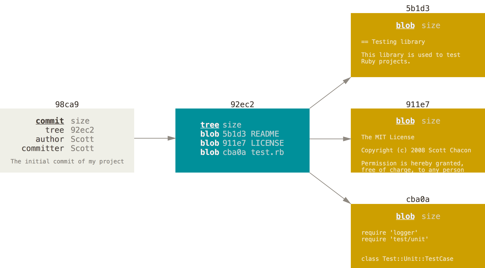

# Branching 

Casi todos los sistemas de Version Control tienen una forma de Branching. Lo cual significa divergir de la linea principal de desarrollo y continuar el trabajo sin afectar la linea principal de desarrollo. Para muchos esta es la opcion que hizo popular a Git y diferente.

### Que es Branching

En Git Branches son muy facil y economicos, y te ayudan a intentar ideas nuevas. Por ejemplo, si tienes una idea para tu pagina web , en lugar de modificar el codigo actual puedes crear un Branch que va a crear una copiar del Commit que quieres modificar. Si tus cambios no funcionar simplemente elimina el Branch y no afecta nada de tu codigo. Pero si quieres implementar tus cambios simplement haces un Merge y creas un nuevo Commit. Este escenario es perfecto para nuevas implementaciones, Bug Fix y experimentacion.

Git a diferencia de otrs VCS trabaja en el mismo directorio al hacer branches, realiza procesos de __fast context switching__ que le permite modificar los archivos rapidamente. De esta manera no duplicamos archivos y seguimos trabajando en un mismo directorio.

La siguiente imagen nos ayudara a enteneder un poco mejor el proceso:


En la siguiente imagen podemos ver como una secuencia de Commits y podemos ver como el Commit con el SHA __ba8ce__ crea un branch que puede ser una modificacion o mejora en el codigo. Uno puede continuar con el master Branch y despues de un tiempo podemos decidir cuando integrarlo.

Cuando realizamos un __commit__ Git realiza un checksum y almacena la metadata en una estructura de arbol y mantiene record de cada cambio. Esto es lo que permite a Git retorceder en el tiempo y regresar a un estado determinado. A continuacion un ejemplo:



Pero cada vez que realizamos un commit nuevo tenemos un apuntador (llamado HEAD) que nos indica en que posicion estamos.


## Crear un nuevo Branch

Para poder crear un nuevo branch tenemos que ejecutar la siguiente instruccion.

```
$git branch < nombre >
```
Esta instruccion creara un nuevo commit al apuntador en donde te encuentras realmente.

Por ejemplo, creemos un branch llamado __test__
```
$git branch test
```
Como resultado tendriamos algo asi.


Pero como sabe Git a que commit estoy apundando ? bueno la respuesta es sencilla Git siempre va apuntar al branch del cual esta copiando. Ahora que tienes un branch a continuacion vamos a cambiarlo y modificarlo.

## Intercambiar entre Branches

En estos momentos nuestro projecto se encuentra de la siguiente manera.


y lo pueden ver con un git log 

```
$git log --oneline --decorate
```

Para poder movernos a nuestro branch llamado __test__ tenemos que hacer la siguiente instruccion 

```
$git checkout < branch >
```

Esta instruccion mueve el cabezar __HEAD__ al commit del nuevo branch.


Ahora si creamos un archivo nuevo y hagamos un commit 
```
$touch test.txt
$git add test.txt
$git commit -m"Nuevo Archivo"
```

El branch __test__ va a tener un nuevo commit y el apuntado __HEAD__ va a avanzar junto con el. En este caso el branch __master__ se quedo atras. 


Ahora si deseamos regresar al branch __master__ lo podemos hacer con el mismo commando __$git checkout__

```
$git checkout master
```


NOTA IMPORTANTE : Recuerda que cada vez que cambiemos de branch. Los archivos en el directorio van modificarse deacuerdo al estado del commit. 

Ahora para poder ver como se encuentra nuetro arbol realizemos un $git log para que como nos aparacer. deberan tener algo parecido a los siguiente:

```
$ git log --oneline --decorate --graph --all
* c2b9e (HEAD, master) made other changes
| * 87ab2 (testing) made a change
|/
* f30ab add feature #32 - ability to add new formats to the
* 34ac2 fixed bug #1328 - stack overflow under certain conditions
* 98ca9 initial commit of my project
```

## Borrar un Branch 

Para eliminar una branch es muy sencillo, con la siguiente instruccion. 
```
$git branch -d < nombre branch > 
```

## Lista de Branch

Para ver cuantos nuemeros de branches existen.
```
$ git branch 
```
Va a marcar con un (*) el branch donde estamos actualmente.

## Mergin Branch 

Ahora vamos a relizar un nuevo branch completamente de cero. Supongamos que tenemos un problema con nuestra pagina y nuestro sistema de rastreo de problemas a sido assignado el numero iss53. Entonces vamos a crear un branch con ese nombre.

```
$ git checkout -b iss53
Switched to a new branch "iss53"
```
__NOTA__ : La opcion __-b__ es equivalente a la siguiente secuencia.
```
$ git branch iss53
$ git checkout iss53
```

Ahora resulta que para poder reeglar ese problema tenmos que agreegr un archivo index.html para poder resolver el problema 

```
$ git checkout iss53
Switched to branch "iss53"
$ vim index.html
$ git commit -a -m 'finished the new footer [issue 53]'
[iss53 ad82d7a] finished the new footer [issue 53]
1 file changed, 1 insertion(+)
```
Y como resultado nuestro arbol va a estar de la siguiente manera.


Ahora para hacer las cosas un poco interesante , regresemos al master branch y creemos un archivo note.txt y hagamos un commit . Lo mismo vamos a hacer con el branch iss53 pero lo vamos a nombrar notas.txt.

```
$ git checkout master 
Switched to branch "master"
$ touch note.txt
$ git add note.txt
$ git commit -m"Added note.txt"
$ git checkout iss53
Switched to branch "iss53"
$ touch notas.txt
$ git commit -m"Added notas.txt"
```

Como resultado nuestro arbol seria lago asi: 


Ahora supongamos que ya terminamos nuestro trabajo y estamos listos para agregar nuestro nuevo codigo al main branch. 

Para poder unir ambos branch tenemos que tener en cuenta que primero tenemos que colocanos en el master branch por que es a donde queremos agregar los cambios. Despues de esto ya podemos seccionar que branch vamos a unir.


Lo que tenemos que hacer es hacer los siguientes pasos :

```
$ git checkout master 
Switched to branch 'master'
$ git merge iss53
```

y como resultado tendremos el siguiente arbol:


__NOTA__ : Es muy comun que al estar realizando Merges y Branches Git detecte Conflictos para esto tendras que usar una herramienta para resolver esto. La mas comun es la que biene con git llamada __mergetool__. 


## Resolver Conflictos de Merge Manualmente

Para resolver los conflictos de un merge tienes que realizar la edicion del decumento que para poder determinar cual cambio es el que deseas. 

Para saber cual archivo es el que tiene tu problema
```
$ git status
```

Un vez que decides que parte vas a conservar (<<<<<<< HEAD,>>>>>>> nombre). Git te muestra donde esta el conflicto y por simple eliminacion y guardar puedes escoger entre cual opcion vamos a guardar.

```index.html
<<<<<<< HEAD
  puts 'hola world'
=======
  puts 'hello mundo'
>>>>>>> mundo
```

una vez que guardemos el cambio , realizamos un __git status__ y vemos que aun no esta listo para confirmar que esta listo para hacer un merge, tenemos que hacer un __git add index.html__ y despues un __git commit__


