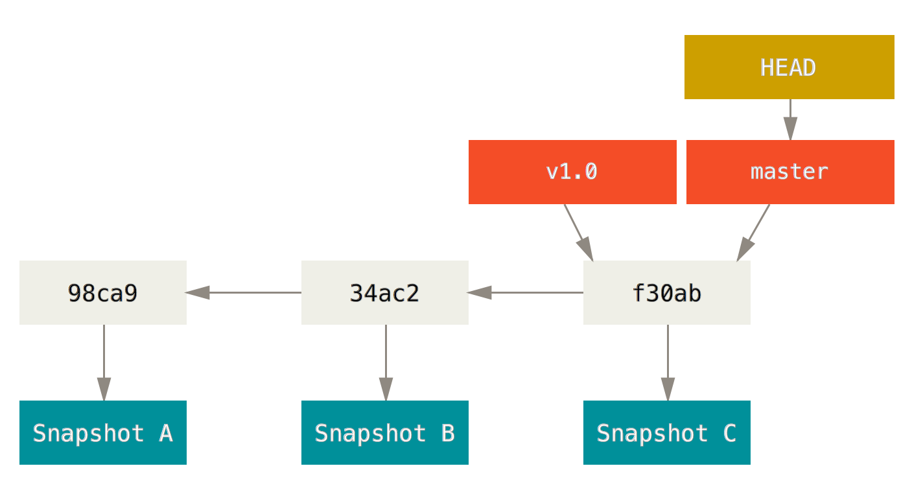
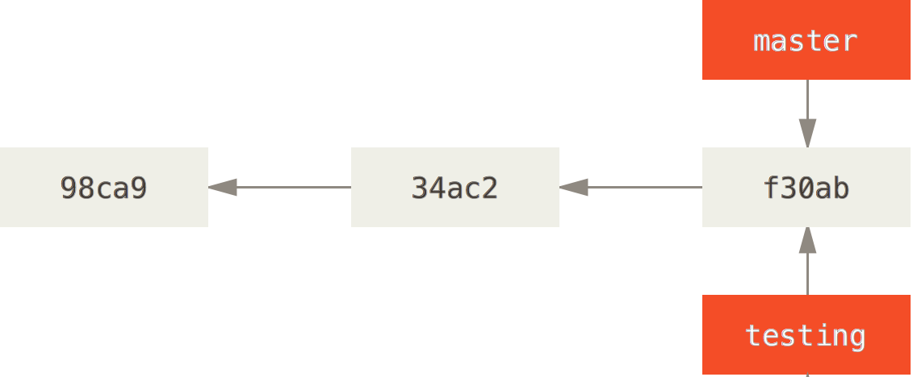

# Branching 

Casi todos los sistemas de Version Control tienen una forma de Branching. Lo cual significa divergir de la linea principal de desarrollo y continuar el trabajo sin afectar la linea principal de desarrollo. Para muchos esta es la opcion que hizo popular a Git y diferente.

### Que es Branching

En Git Branches son muy facil y economicos, y te ayudan a intentar ideas nuevas. Por ejemplo, si tienes una idea para tu pagina web , en lugar de modificar el codigo actual puedes crear un Branch que va a crear una copiar del Commit que quieres modificar. Si tus cambios no funcionar simplemente elimina el Branch y no afecta nada de tu codigo. Pero si quieres implementar tus cambios simplement haces un Merge y creas un nuevo Commit. Este escenario es perfecto para nuevas implementaciones, Bug Fix y experimentacion.

Git a diferencia de otrs VCS trabaja en el mismo directorio al hacer branches, realiza procesos de __fast context switching__ que le permite modificar los archivos rapidamente. De esta manera no duplicamos archivos y seguimos trabajando en un mismo directorio.

La siguiente imagen nos ayudara a enteneder un poco mejor el proceso:


En la siguiente imagen podemos ver como una secuencia de Commits y podemos ver como el Commit con el SHA __ba8ce__ crea un branch que puede ser una modificacion o mejora en el codigo. Uno puede continuar con el master Branch y despues de un tiempo podemos decidir cuando integrarlo.

Cuando realizamos un __commit__ Git realiza un checksum y almacena la metadata en una estructura de arbol y mantiene record de cada cambio. Esto es lo que permite a Git retorceder en el tiempo y regresar a un estado determinado. A continuacion un ejemplo:


Pero cada vez que realizamos un commit nuevo tenemos un apuntador (llamado HEAD) que nos indica en que posicion estamos.



## Crear un nuevo Branch

Para poder crear un nuevo branch tenemos que ejecutar la siguiente instruccion.

```
$git branch < nombre >
```
Esta instruccion creara un nuevo commit al apuntador en donde te encuentras realmente.

Por ejemplo, creemos un branch llamado __test__
```
$git branch test
```
Como resultado tendriamos algo asi.



Pero como sabe Git a que commit estoy apundando ? bueno la respuesta es sencilla Git siempre va apuntar al branch del cual esta copiando. Ahora que tienes un branch a continuacion vamos a cambiarlo y modificarlo.

## Intercambiar entre Branches

En estos momentos nuestro projecto se encuentra de la siguiente manera.


y lo pueden ver con un git log 

```
$git log --oneline --decorate
```

Para poder movernos a nuestro branch llamado __test__ tenemos que hacer la siguiente instruccion 

```
$git checkout < branch >
```

Esta instruccion mueve el cabezar __HEAD__ al commit del nuevo branch.


Ahora si creamos un archivo nuevo y hagamos un commit 
```
$touch test.txt
$git add test.txt
$git commit -m"Nuevo Archivo"
```

El branch __test__ va a tener un nuevo commit y el apuntado __HEAD__ va a avanzar junto con el. En este caso el branch __master__ se quedo atras. 


Ahora si deseamos regresar al branch __master__ lo podemos hacer con el mismo commando __$git checkout__

```
$git checkout master
```


